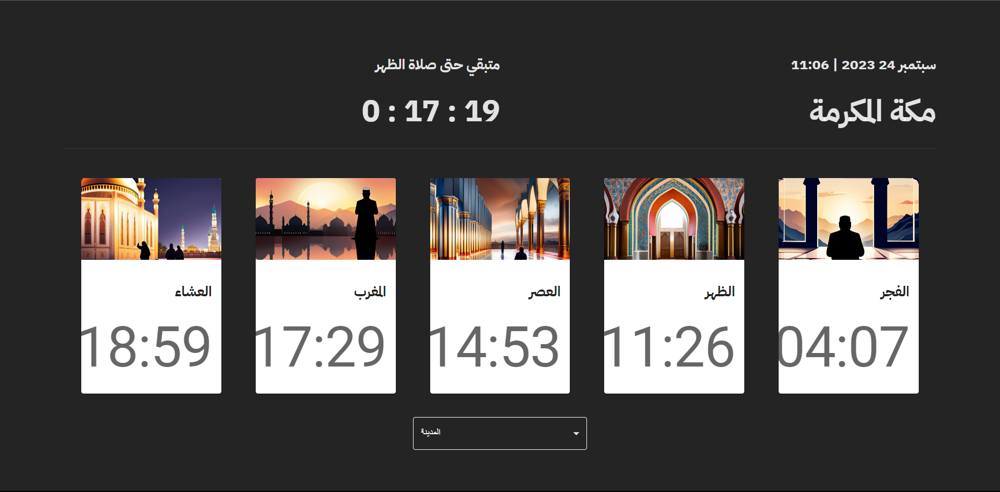

<div align="center">
  
</div>

# 🚀 Welcome to My Stylish Web Project

<p align="center">
  Explore this stunning website showcasing my skills in web development, including HTML, CSS, JavaScript, React, and more.
</p>

<div align="center">
  <strong>Key Features:</strong>
  <ul>
    <li>Clean Design</li>
    <li>Optimized User Experience</li>
    <li>Dynamic Interactions</li>
  </ul>
</div>

<div align="center">
  <strong>Languages and Tools Used:</strong>
  <br />
  
  
  
  
  
  
  
</div>

## 🛠️ Getting Started

### Installation

1. Clone the repository to your local machine:

   ```shell
   git clone https://github.com/ABDULLAHRH1/PrayerTimes.git
